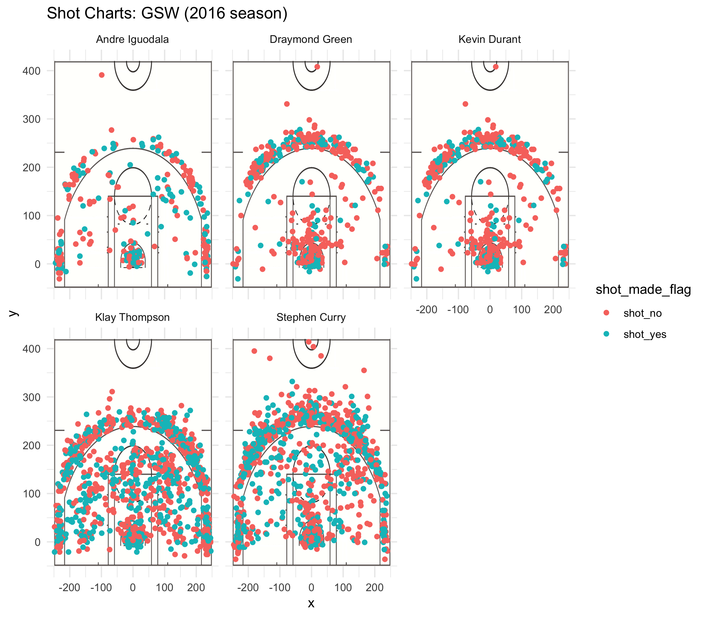

Effective Shooting Percentages
================
Krista Waugh

According to this [article](https://sircharlesincharge.com/2019/03/13/golden-state-warriors-serious-concern/) in *Fansided*, the Golden State Warriors main weakness is their defense, as the demonstrated in their recent loss against the Phoenix Suns. It is hard to admit that the Bay Area's beloved Warriors may have any weakness at all, so I wont. Here I have analyzed only the shooting percentages of the Warriors offensive players from their legendary 2016/2017 season. Is this a thorough analysis of the Warriors overall performance as a team? Not particularly, but it does bring to light some of what makes them one of the most talked about teams in NBA history: their undeniably high shooting success rates.

The two years prior to the 2014/2015 season, the Warriors finished 6th in the league, and before that from the mid 90s until their 6th place finish in 2013, they were hanging out around 10th place overall. The 2016/2017 season was Kevin Durant’s first season with the Warriors, after playing for Oklahoma City Thunder for nine seasons, experiencing some tough losses to the Warriors during the Finals, and ultimately never winning a finals with OKC Thunder. Stephen Curry, Klay Thompson, Draymond Green, and Andre Iguodala are some of the most famous names in this new wave of Warriors fame, from what I understand as someone who sat through their first basketball game in the spring of 2015, along with what seems like the great majority of today’s Warrior fans.

Understandably so, as the Bay Area is such a hub of technology, food, and entertainment- the Warriors had to be the best in order to take the spotlight among all the other stimulation present in the area. The sports industry is ultimately a business, and the number of Warriors jerseys sported around town during May and June indicate that business is booming. This can be attributed almost completely to how fun these men are to watch. People like basketball probably for a lot of reasons, but a big one is how fast paced it is. If you leave the room to grab a beer you will have missed something, unlike soccer or football. Being a Warriors fan for the sake of entertainment is great because they keep shooting and keep making it, which is what my analysis is centered around: shooting percentages.

``` r

```


``` r
library(dplyr)
```

    ## 
    ## Attaching package: 'dplyr'

    ## The following objects are masked from 'package:stats':
    ## 
    ##     filter, lag

    ## The following objects are masked from 'package:base':
    ## 
    ##     intersect, setdiff, setequal, union

``` r
library(readr)
library(formattable)
library(knitr)
```

``` r
setwd("/Users/kristawaugh/Documents/Spring19/Stat133/workout01/report")
shots_data <- read_csv("shots_data.csv", col_names = TRUE)
```

    ## Parsed with column specification:
    ## cols(
    ##   team_name = col_character(),
    ##   game_date = col_character(),
    ##   season = col_double(),
    ##   period = col_double(),
    ##   minutes_remaining = col_double(),
    ##   seconds_remaining = col_double(),
    ##   shot_made_flag = col_character(),
    ##   action_type = col_character(),
    ##   shot_type = col_character(),
    ##   shot_distance = col_double(),
    ##   opponent = col_character(),
    ##   x = col_double(),
    ##   y = col_double(),
    ##   Name = col_character(),
    ##   minute = col_double()
    ## )

``` r
shots_data
```

    ## # A tibble: 3,997 x 15
    ##    team_name game_date season period minutes_remaini… seconds_remaini…
    ##    <chr>     <chr>      <dbl>  <dbl>            <dbl>            <dbl>
    ##  1 Golden S… 11/1/16     2016      1                9               28
    ##  2 Golden S… 2/23/17     2016      4               10               16
    ##  3 Golden S… 2/25/17     2016      3                5               30
    ##  4 Golden S… 3/21/17     2016      4                8               56
    ##  5 Golden S… 11/21/16    2016      2                4               39
    ##  6 Golden S… 12/30/16    2016      4                7               17
    ##  7 Golden S… 11/7/16     2016      4                7               46
    ##  8 Golden S… 12/5/16     2016      2                8               55
    ##  9 Golden S… 11/25/16    2016      4                7               31
    ## 10 Golden S… 11/13/16    2016      2                8               47
    ## # ... with 3,987 more rows, and 9 more variables: shot_made_flag <chr>,
    ## #   action_type <chr>, shot_type <chr>, shot_distance <dbl>,
    ## #   opponent <chr>, x <dbl>, y <dbl>, Name <chr>, minute <dbl>

``` r
shots2pt_klay <- filter(shots_data, shot_type == "2PT Field Goal" & Name == "Klay Thompson")
shots2pt_klay
```

    # A tibble: 640 x 15
       team_name game_date season period minutes_remaini… seconds_remaini…
       <chr>     <chr>      <dbl>  <dbl>            <dbl>            <dbl>
     1 Golden S… 11/1/16     2016      1                9               28
     2 Golden S… 2/23/17     2016      4               10               16
     3 Golden S… 2/25/17     2016      3                5               30
     4 Golden S… 3/21/17     2016      4                8               56
     5 Golden S… 11/21/16    2016      2                4               39
     6 Golden S… 12/30/16    2016      4                7               17
     7 Golden S… 11/7/16     2016      4                7               46
     8 Golden S… 12/5/16     2016      2                8               55
     9 Golden S… 11/25/16    2016      4                7               31
    10 Golden S… 11/13/16    2016      2                8               47
    # ... with 630 more rows, and 9 more variables: shot_made_flag <chr>,
    #   action_type <chr>, shot_type <chr>, shot_distance <dbl>,
    #   opponent <chr>, x <dbl>, y <dbl>, Name <chr>, minute <dbl>

``` r
#640 rows

filter(shots2pt_klay, shot_made_flag == "shot_yes")
```

    # A tibble: 329 x 15
       team_name game_date season period minutes_remaini… seconds_remaini…
       <chr>     <chr>      <dbl>  <dbl>            <dbl>            <dbl>
     1 Golden S… 11/1/16     2016      1                9               28
     2 Golden S… 2/23/17     2016      4               10               16
     3 Golden S… 2/25/17     2016      3                5               30
     4 Golden S… 3/21/17     2016      4                8               56
     5 Golden S… 11/21/16    2016      2                4               39
     6 Golden S… 12/30/16    2016      4                7               17
     7 Golden S… 11/7/16     2016      4                7               46
     8 Golden S… 12/5/16     2016      2                8               55
     9 Golden S… 11/25/16    2016      4                7               31
    10 Golden S… 11/13/16    2016      2                8               47
    # ... with 319 more rows, and 9 more variables: shot_made_flag <chr>,
    #   action_type <chr>, shot_type <chr>, shot_distance <dbl>,
    #   opponent <chr>, x <dbl>, y <dbl>, Name <chr>, minute <dbl>

``` r
#329 rows 

#329/640 = 0.5140625
```

``` r
shots2pt_andre <- filter(shots_data, shot_type == "2PT Field Goal" & Name == "Andre Iguodala")
shots2pt_andre
```

    # A tibble: 210 x 15
       team_name game_date season period minutes_remaini… seconds_remaini…
       <chr>     <chr>      <dbl>  <dbl>            <dbl>            <dbl>
     1 Golden S… 3/24/17     2016      3                2               35
     2 Golden S… 11/3/16     2016      2               10               51
     3 Golden S… 10/25/16    2016      2                0                6
     4 Golden S… 11/3/16     2016      2               11               10
     5 Golden S… 1/8/17      2016      4                0               32
     6 Golden S… 3/16/17     2016      3                5               30
     7 Golden S… 1/2/17      2016      4                7               57
     8 Golden S… 12/7/16     2016      4                9               31
     9 Golden S… 2/28/17     2016      2                0               23
    10 Golden S… 2/1/17      2016      2                0                2
    # ... with 200 more rows, and 9 more variables: shot_made_flag <chr>,
    #   action_type <chr>, shot_type <chr>, shot_distance <dbl>,
    #   opponent <chr>, x <dbl>, y <dbl>, Name <chr>, minute <dbl>

``` r
#210 rows

filter(shots2pt_andre, shot_made_flag == "shot_yes")
```

    # A tibble: 134 x 15
       team_name game_date season period minutes_remaini… seconds_remaini…
       <chr>     <chr>      <dbl>  <dbl>            <dbl>            <dbl>
     1 Golden S… 10/25/16    2016      2                0                6
     2 Golden S… 1/8/17      2016      4                0               32
     3 Golden S… 3/16/17     2016      3                5               30
     4 Golden S… 1/2/17      2016      4                7               57
     5 Golden S… 12/7/16     2016      4                9               31
     6 Golden S… 2/28/17     2016      2                0               23
     7 Golden S… 2/1/17      2016      2                0                2
     8 Golden S… 11/25/16    2016      1                0               44
     9 Golden S… 2/13/17     2016      1                0               41
    10 Golden S… 12/28/16    2016      2                3               34
    # ... with 124 more rows, and 9 more variables: shot_made_flag <chr>,
    #   action_type <chr>, shot_type <chr>, shot_distance <dbl>,
    #   opponent <chr>, x <dbl>, y <dbl>, Name <chr>, minute <dbl>

``` r
#134 rows 

#134/210 =  0.6380952
```

``` r
shots2pt_draymond <- filter(shots_data, shot_type == "2PT Field Goal" & Name == "Draymond Green")
shots2pt_draymond
```

    # A tibble: 346 x 15
       team_name game_date season period minutes_remaini… seconds_remaini…
       <chr>     <chr>      <dbl>  <dbl>            <dbl>            <dbl>
     1 Golden S… 3/5/17      2016      3                7               50
     2 Golden S… 12/30/16    2016      3                7               48
     3 Golden S… 1/16/17     2016      1                9                6
     4 Golden S… 12/7/16     2016      2                0               43
     5 Golden S… 11/19/16    2016      1                8               43
     6 Golden S… 1/22/17     2016      3                9               27
     7 Golden S… 11/4/16     2016      4                6                6
     8 Golden S… 3/16/17     2016      3                1               20
     9 Golden S… 2/4/17      2016      4                0               57
    10 Golden S… 12/20/16    2016      3                3               22
    # ... with 336 more rows, and 9 more variables: shot_made_flag <chr>,
    #   action_type <chr>, shot_type <chr>, shot_distance <dbl>,
    #   opponent <chr>, x <dbl>, y <dbl>, Name <chr>, minute <dbl>

``` r
#346 rows

filter(shots2pt_draymond, shot_made_flag == "shot_yes")
```

    # A tibble: 171 x 15
       team_name game_date season period minutes_remaini… seconds_remaini…
       <chr>     <chr>      <dbl>  <dbl>            <dbl>            <dbl>
     1 Golden S… 3/5/17      2016      3                7               50
     2 Golden S… 12/30/16    2016      3                7               48
     3 Golden S… 1/16/17     2016      1                9                6
     4 Golden S… 12/7/16     2016      2                0               43
     5 Golden S… 11/19/16    2016      1                8               43
     6 Golden S… 1/22/17     2016      3                9               27
     7 Golden S… 11/4/16     2016      4                6                6
     8 Golden S… 3/16/17     2016      3                1               20
     9 Golden S… 2/4/17      2016      4                0               57
    10 Golden S… 12/20/16    2016      3                3               22
    # ... with 161 more rows, and 9 more variables: shot_made_flag <chr>,
    #   action_type <chr>, shot_type <chr>, shot_distance <dbl>,
    #   opponent <chr>, x <dbl>, y <dbl>, Name <chr>, minute <dbl>

``` r
#171 rows 

#171/346 =  0.4942197
```

``` r
shots2pt_steph <- filter(shots_data, shot_type == "2PT Field Goal" & Name == "Stephen Curry")
shots2pt_steph
```

    ## # A tibble: 563 x 15
    ##    team_name game_date season period minutes_remaini… seconds_remaini…
    ##    <chr>     <chr>      <dbl>  <dbl>            <dbl>            <dbl>
    ##  1 Golden S… 12/15/16    2016      3                3               51
    ##  2 Golden S… 10/28/16    2016      3                9               14
    ##  3 Golden S… 11/1/16     2016      2                5                8
    ##  4 Golden S… 12/1/16     2016      3                5               27
    ##  5 Golden S… 4/4/17      2016      3                2                4
    ##  6 Golden S… 11/19/16    2016      4                5               36
    ##  7 Golden S… 11/21/16    2016      3                9               51
    ##  8 Golden S… 3/29/17     2016      2                1               40
    ##  9 Golden S… 11/25/16    2016      3               10               59
    ## 10 Golden S… 12/28/16    2016      3                3               54
    ## # ... with 553 more rows, and 9 more variables: shot_made_flag <chr>,
    ## #   action_type <chr>, shot_type <chr>, shot_distance <dbl>,
    ## #   opponent <chr>, x <dbl>, y <dbl>, Name <chr>, minute <dbl>

``` r
#563 rows

filter(shots2pt_steph, shot_made_flag == "shot_yes")
```

    ## # A tibble: 304 x 15
    ##    team_name game_date season period minutes_remaini… seconds_remaini…
    ##    <chr>     <chr>      <dbl>  <dbl>            <dbl>            <dbl>
    ##  1 Golden S… 12/15/16    2016      3                3               51
    ##  2 Golden S… 10/28/16    2016      3                9               14
    ##  3 Golden S… 11/1/16     2016      2                5                8
    ##  4 Golden S… 12/1/16     2016      3                5               27
    ##  5 Golden S… 4/4/17      2016      3                2                4
    ##  6 Golden S… 11/19/16    2016      4                5               36
    ##  7 Golden S… 11/21/16    2016      3                9               51
    ##  8 Golden S… 3/29/17     2016      2                1               40
    ##  9 Golden S… 11/25/16    2016      3               10               59
    ## 10 Golden S… 12/28/16    2016      3                3               54
    ## # ... with 294 more rows, and 9 more variables: shot_made_flag <chr>,
    ## #   action_type <chr>, shot_type <chr>, shot_distance <dbl>,
    ## #   opponent <chr>, x <dbl>, y <dbl>, Name <chr>, minute <dbl>

``` r
#304 rows 

#304/563 =  0.5399645
```

``` r
shots2pt_kd <- filter(shots_data, shot_type == "2PT Field Goal" & Name == "Kevin Durant")
shots2pt_kd
```

    # A tibble: 346 x 15
       team_name game_date season period minutes_remaini… seconds_remaini…
       <chr>     <chr>      <dbl>  <dbl>            <dbl>            <dbl>
     1 Golden S… 3/5/17      2016      3                7               50
     2 Golden S… 12/30/16    2016      3                7               48
     3 Golden S… 1/16/17     2016      1                9                6
     4 Golden S… 12/7/16     2016      2                0               43
     5 Golden S… 11/19/16    2016      1                8               43
     6 Golden S… 1/22/17     2016      3                9               27
     7 Golden S… 11/4/16     2016      4                6                6
     8 Golden S… 3/16/17     2016      3                1               20
     9 Golden S… 2/4/17      2016      4                0               57
    10 Golden S… 12/20/16    2016      3                3               22
    # ... with 336 more rows, and 9 more variables: shot_made_flag <chr>,
    #   action_type <chr>, shot_type <chr>, shot_distance <dbl>,
    #   opponent <chr>, x <dbl>, y <dbl>, Name <chr>, minute <dbl>

``` r
#643 rows

filter(shots2pt_kd, shot_made_flag == "shot_yes")
```

    # A tibble: 171 x 15
       team_name game_date season period minutes_remaini… seconds_remaini…
       <chr>     <chr>      <dbl>  <dbl>            <dbl>            <dbl>
     1 Golden S… 3/5/17      2016      3                7               50
     2 Golden S… 12/30/16    2016      3                7               48
     3 Golden S… 1/16/17     2016      1                9                6
     4 Golden S… 12/7/16     2016      2                0               43
     5 Golden S… 11/19/16    2016      1                8               43
     6 Golden S… 1/22/17     2016      3                9               27
     7 Golden S… 11/4/16     2016      4                6                6
     8 Golden S… 3/16/17     2016      3                1               20
     9 Golden S… 2/4/17      2016      4                0               57
    10 Golden S… 12/20/16    2016      3                3               22
    # ... with 161 more rows, and 9 more variables: shot_made_flag <chr>,
    #   action_type <chr>, shot_type <chr>, shot_distance <dbl>,
    #   opponent <chr>, x <dbl>, y <dbl>, Name <chr>, minute <dbl>

``` r
#390 rows 

#171/346 = 0.4942197
```

``` r
shots3pt_kd <- filter(shots_data, shot_type == "3PT Field Goal" & Name == "Kevin Durant")
shots3pt_kd
```

    # A tibble: 232 x 15
       team_name game_date season period minutes_remaini… seconds_remaini…
       <chr>     <chr>      <dbl>  <dbl>            <dbl>            <dbl>
     1 Golden S… 11/16/16    2016      4                6               23
     2 Golden S… 2/27/17     2016      4                6               26
     3 Golden S… 3/31/17     2016      4                4               51
     4 Golden S… 3/31/17     2016      3               11               28
     5 Golden S… 3/31/17     2016      3                0               33
     6 Golden S… 3/29/17     2016      1                8               11
     7 Golden S… 3/28/17     2016      4                1               12
     8 Golden S… 3/28/17     2016      3                4                1
     9 Golden S… 3/28/17     2016      1                1               36
    10 Golden S… 3/28/17     2016      2                5               59
    # ... with 222 more rows, and 9 more variables: shot_made_flag <chr>,
    #   action_type <chr>, shot_type <chr>, shot_distance <dbl>,
    #   opponent <chr>, x <dbl>, y <dbl>, Name <chr>, minute <dbl>

``` r
#272 rows

filter(shots3pt_kd, shot_made_flag == "shot_yes")
```

    # A tibble: 74 x 15
       team_name game_date season period minutes_remaini… seconds_remaini…
       <chr>     <chr>      <dbl>  <dbl>            <dbl>            <dbl>
     1 Golden S… 2/27/17     2016      4                6               26
     2 Golden S… 3/28/17     2016      1                6                9
     3 Golden S… 3/21/17     2016      1                1               54
     4 Golden S… 3/6/17      2016      3               10               15
     5 Golden S… 3/6/17      2016      1               11                7
     6 Golden S… 3/5/17      2016      1                9               52
     7 Golden S… 3/2/17      2016      2                1               37
     8 Golden S… 3/2/17      2016      3                9               36
     9 Golden S… 2/28/17     2016      4                1                4
    10 Golden S… 2/28/17     2016      4                2               17
    # ... with 64 more rows, and 9 more variables: shot_made_flag <chr>,
    #   action_type <chr>, shot_type <chr>, shot_distance <dbl>,
    #   opponent <chr>, x <dbl>, y <dbl>, Name <chr>, minute <dbl>

``` r
#105 rows 

#74/232 = 0.3189655
```

``` r
shots3pt_draymond <- filter(shots_data, shot_type == "3PT Field Goal" & Name == "Draymond Green")
shots3pt_draymond
```

    ## # A tibble: 232 x 15
    ##    team_name game_date season period minutes_remaini… seconds_remaini…
    ##    <chr>     <chr>      <dbl>  <dbl>            <dbl>            <dbl>
    ##  1 Golden S… 11/16/16    2016      4                6               23
    ##  2 Golden S… 2/27/17     2016      4                6               26
    ##  3 Golden S… 3/31/17     2016      4                4               51
    ##  4 Golden S… 3/31/17     2016      3               11               28
    ##  5 Golden S… 3/31/17     2016      3                0               33
    ##  6 Golden S… 3/29/17     2016      1                8               11
    ##  7 Golden S… 3/28/17     2016      4                1               12
    ##  8 Golden S… 3/28/17     2016      3                4                1
    ##  9 Golden S… 3/28/17     2016      1                1               36
    ## 10 Golden S… 3/28/17     2016      2                5               59
    ## # ... with 222 more rows, and 9 more variables: shot_made_flag <chr>,
    ## #   action_type <chr>, shot_type <chr>, shot_distance <dbl>,
    ## #   opponent <chr>, x <dbl>, y <dbl>, Name <chr>, minute <dbl>

``` r
#232 rows

filter(shots3pt_draymond, shot_made_flag == "shot_yes")
```

    ## # A tibble: 74 x 15
    ##    team_name game_date season period minutes_remaini… seconds_remaini…
    ##    <chr>     <chr>      <dbl>  <dbl>            <dbl>            <dbl>
    ##  1 Golden S… 2/27/17     2016      4                6               26
    ##  2 Golden S… 3/28/17     2016      1                6                9
    ##  3 Golden S… 3/21/17     2016      1                1               54
    ##  4 Golden S… 3/6/17      2016      3               10               15
    ##  5 Golden S… 3/6/17      2016      1               11                7
    ##  6 Golden S… 3/5/17      2016      1                9               52
    ##  7 Golden S… 3/2/17      2016      2                1               37
    ##  8 Golden S… 3/2/17      2016      3                9               36
    ##  9 Golden S… 2/28/17     2016      4                1                4
    ## 10 Golden S… 2/28/17     2016      4                2               17
    ## # ... with 64 more rows, and 9 more variables: shot_made_flag <chr>,
    ## #   action_type <chr>, shot_type <chr>, shot_distance <dbl>,
    ## #   opponent <chr>, x <dbl>, y <dbl>, Name <chr>, minute <dbl>

``` r
#74 rows 

#74/232 = 0.3189655
```

``` r
shots3pt_curry <- filter(shots_data, shot_type == "3PT Field Goal" & Name == "Stephen Curry")
shots3pt_curry
```

    # A tibble: 687 x 15
       team_name game_date season period minutes_remaini… seconds_remaini…
       <chr>     <chr>      <dbl>  <dbl>            <dbl>            <dbl>
     1 Golden S… 11/18/16    2016      4                1               13
     2 Golden S… 11/3/16     2016      3                6                1
     3 Golden S… 3/18/17     2016      1                0                3
     4 Golden S… 11/10/16    2016      3                3               25
     5 Golden S… 3/16/17     2016      3               11               36
     6 Golden S… 3/31/17     2016      3                5               31
     7 Golden S… 1/22/17     2016      2                1                3
     8 Golden S… 11/4/16     2016      2                2               33
     9 Golden S… 11/4/16     2016      2                8               42
    10 Golden S… 11/4/16     2016      2                6               23
    # ... with 677 more rows, and 9 more variables: shot_made_flag <chr>,
    #   action_type <chr>, shot_type <chr>, shot_distance <dbl>,
    #   opponent <chr>, x <dbl>, y <dbl>, Name <chr>, minute <dbl>

``` r
#687 rows

filter(shots3pt_curry, shot_made_flag == "shot_yes")
```

    # A tibble: 280 x 15
       team_name game_date season period minutes_remaini… seconds_remaini…
       <chr>     <chr>      <dbl>  <dbl>            <dbl>            <dbl>
     1 Golden S… 11/18/16    2016      4                1               13
     2 Golden S… 11/3/16     2016      3                6                1
     3 Golden S… 3/18/17     2016      1                0                3
     4 Golden S… 11/10/16    2016      3                3               25
     5 Golden S… 3/16/17     2016      3               11               36
     6 Golden S… 1/22/17     2016      2                1                3
     7 Golden S… 3/2/17      2016      3                6               28
     8 Golden S… 3/2/17      2016      2                3               13
     9 Golden S… 11/10/16    2016      3                4               12
    10 Golden S… 11/10/16    2016      1                6               32
    # ... with 270 more rows, and 9 more variables: shot_made_flag <chr>,
    #   action_type <chr>, shot_type <chr>, shot_distance <dbl>,
    #   opponent <chr>, x <dbl>, y <dbl>, Name <chr>, minute <dbl>

``` r
#280 rows 

#280/687 = 0.4075691
```

``` r
shots3pt_thompson <- filter(shots_data, shot_type == "3PT Field Goal" & Name == "Klay Thompson")
shots3pt_thompson
```

    # A tibble: 580 x 15
       team_name game_date season period minutes_remaini… seconds_remaini…
       <chr>     <chr>      <dbl>  <dbl>            <dbl>            <dbl>
     1 Golden S… 3/21/17     2016      3                7               49
     2 Golden S… 11/23/16    2016      3                3               26
     3 Golden S… 11/23/16    2016      3                7               49
     4 Golden S… 10/30/16    2016      1                6               14
     5 Golden S… 10/30/16    2016      3                3               56
     6 Golden S… 10/30/16    2016      1               10               51
     7 Golden S… 10/30/16    2016      4                4               14
     8 Golden S… 10/30/16    2016      4                0               53
     9 Golden S… 11/7/16     2016      1               10                5
    10 Golden S… 11/7/16     2016      1                5               35
    # ... with 570 more rows, and 9 more variables: shot_made_flag <chr>,
    #   action_type <chr>, shot_type <chr>, shot_distance <dbl>,
    #   opponent <chr>, x <dbl>, y <dbl>, Name <chr>, minute <dbl>

``` r
#580 rows

filter(shots3pt_thompson, shot_made_flag == "shot_yes")
```

    # A tibble: 246 x 15
       team_name game_date season period minutes_remaini… seconds_remaini…
       <chr>     <chr>      <dbl>  <dbl>            <dbl>            <dbl>
     1 Golden S… 11/23/16    2016      3                3               26
     2 Golden S… 11/23/16    2016      3                7               49
     3 Golden S… 11/7/16     2016      2                5               34
     4 Golden S… 3/20/17     2016      3                4               51
     5 Golden S… 3/20/17     2016      2                6               45
     6 Golden S… 3/20/17     2016      1                4               45
     7 Golden S… 3/20/17     2016      3                5               26
     8 Golden S… 3/20/17     2016      3                3               19
     9 Golden S… 3/20/17     2016      3               10               37
    10 Golden S… 1/16/17     2016      3                7               46
    # ... with 236 more rows, and 9 more variables: shot_made_flag <chr>,
    #   action_type <chr>, shot_type <chr>, shot_distance <dbl>,
    #   opponent <chr>, x <dbl>, y <dbl>, Name <chr>, minute <dbl>

``` r
#246 rows 

#246/580 =  0.4241379
```

``` r
shots3pt_andre <- filter(shots_data, shot_type == "3PT Field Goal" & Name == "Andre Iguodala")
shots3pt_andre
```

    # A tibble: 161 x 15
       team_name game_date season period minutes_remaini… seconds_remaini…
       <chr>     <chr>      <dbl>  <dbl>            <dbl>            <dbl>
     1 Golden S… 3/2/17      2016      2                0               22
     2 Golden S… 3/31/17     2016      1                2                2
     3 Golden S… 3/31/17     2016      2                0                0
     4 Golden S… 3/31/17     2016      4                8               12
     5 Golden S… 3/31/17     2016      2                8               11
     6 Golden S… 3/31/17     2016      1                1               29
     7 Golden S… 3/31/17     2016      4                1               39
     8 Golden S… 3/29/17     2016      2               10                3
     9 Golden S… 3/29/17     2016      1                2               31
    10 Golden S… 3/29/17     2016      2                4               39
    # ... with 151 more rows, and 9 more variables: shot_made_flag <chr>,
    #   action_type <chr>, shot_type <chr>, shot_distance <dbl>,
    #   opponent <chr>, x <dbl>, y <dbl>, Name <chr>, minute <dbl>

``` r
#161 rows

filter(shots3pt_andre, shot_made_flag == "shot_yes")
```

    # A tibble: 58 x 15
       team_name game_date season period minutes_remaini… seconds_remaini…
       <chr>     <chr>      <dbl>  <dbl>            <dbl>            <dbl>
     1 Golden S… 3/31/17     2016      1                2                2
     2 Golden S… 3/31/17     2016      2                0                0
     3 Golden S… 3/29/17     2016      1                2               31
     4 Golden S… 3/29/17     2016      2                4               39
     5 Golden S… 3/28/17     2016      3                4               31
     6 Golden S… 3/26/17     2016      1                5                5
     7 Golden S… 3/6/17      2016      4                2               38
     8 Golden S… 3/6/17      2016      2                4               48
     9 Golden S… 3/6/17      2016      1                4               44
    10 Golden S… 3/6/17      2016      4                6                9
    # ... with 48 more rows, and 9 more variables: shot_made_flag <chr>,
    #   action_type <chr>, shot_type <chr>, shot_distance <dbl>,
    #   opponent <chr>, x <dbl>, y <dbl>, Name <chr>, minute <dbl>

``` r
#58 rows 

#58/161 = 0.3602484
```

``` r
shots_klay <- filter(shots_data, Name == "Klay Thompson")
shots_klay
```

    # A tibble: 1,220 x 15
       team_name game_date season period minutes_remaini… seconds_remaini…
       <chr>     <chr>      <dbl>  <dbl>            <dbl>            <dbl>
     1 Golden S… 11/1/16     2016      1                9               28
     2 Golden S… 2/23/17     2016      4               10               16
     3 Golden S… 2/25/17     2016      3                5               30
     4 Golden S… 3/21/17     2016      4                8               56
     5 Golden S… 11/21/16    2016      2                4               39
     6 Golden S… 12/30/16    2016      4                7               17
     7 Golden S… 11/7/16     2016      4                7               46
     8 Golden S… 12/5/16     2016      2                8               55
     9 Golden S… 11/25/16    2016      4                7               31
    10 Golden S… 11/13/16    2016      2                8               47
    # ... with 1,210 more rows, and 9 more variables: shot_made_flag <chr>,
    #   action_type <chr>, shot_type <chr>, shot_distance <dbl>,
    #   opponent <chr>, x <dbl>, y <dbl>, Name <chr>, minute <dbl>

``` r
#1220 rows

filter(shots_klay, shot_made_flag == "shot_yes")
```

    # A tibble: 575 x 15
       team_name game_date season period minutes_remaini… seconds_remaini…
       <chr>     <chr>      <dbl>  <dbl>            <dbl>            <dbl>
     1 Golden S… 11/1/16     2016      1                9               28
     2 Golden S… 2/23/17     2016      4               10               16
     3 Golden S… 2/25/17     2016      3                5               30
     4 Golden S… 3/21/17     2016      4                8               56
     5 Golden S… 11/21/16    2016      2                4               39
     6 Golden S… 12/30/16    2016      4                7               17
     7 Golden S… 11/7/16     2016      4                7               46
     8 Golden S… 12/5/16     2016      2                8               55
     9 Golden S… 11/25/16    2016      4                7               31
    10 Golden S… 11/13/16    2016      2                8               47
    # ... with 565 more rows, and 9 more variables: shot_made_flag <chr>,
    #   action_type <chr>, shot_type <chr>, shot_distance <dbl>,
    #   opponent <chr>, x <dbl>, y <dbl>, Name <chr>, minute <dbl>

``` r
#575 rows 

shots_steph <- filter(shots_data, Name == "Stephen Curry")
shots_steph
```

    # A tibble: 1,250 x 15
       team_name game_date season period minutes_remaini… seconds_remaini…
       <chr>     <chr>      <dbl>  <dbl>            <dbl>            <dbl>
     1 Golden S… 12/15/16    2016      3                3               51
     2 Golden S… 10/28/16    2016      3                9               14
     3 Golden S… 11/1/16     2016      2                5                8
     4 Golden S… 12/1/16     2016      3                5               27
     5 Golden S… 4/4/17      2016      3                2                4
     6 Golden S… 11/19/16    2016      4                5               36
     7 Golden S… 11/21/16    2016      3                9               51
     8 Golden S… 3/29/17     2016      2                1               40
     9 Golden S… 11/25/16    2016      3               10               59
    10 Golden S… 12/28/16    2016      3                3               54
    # ... with 1,240 more rows, and 9 more variables: shot_made_flag <chr>,
    #   action_type <chr>, shot_type <chr>, shot_distance <dbl>,
    #   opponent <chr>, x <dbl>, y <dbl>, Name <chr>, minute <dbl>

``` r
#1250 rows

filter(shots_steph, shot_made_flag == "shot_yes")
```

    # A tibble: 584 x 15
       team_name game_date season period minutes_remaini… seconds_remaini…
       <chr>     <chr>      <dbl>  <dbl>            <dbl>            <dbl>
     1 Golden S… 12/15/16    2016      3                3               51
     2 Golden S… 10/28/16    2016      3                9               14
     3 Golden S… 11/1/16     2016      2                5                8
     4 Golden S… 12/1/16     2016      3                5               27
     5 Golden S… 4/4/17      2016      3                2                4
     6 Golden S… 11/19/16    2016      4                5               36
     7 Golden S… 11/21/16    2016      3                9               51
     8 Golden S… 3/29/17     2016      2                1               40
     9 Golden S… 11/25/16    2016      3               10               59
    10 Golden S… 12/28/16    2016      3                3               54
    # ... with 574 more rows, and 9 more variables: shot_made_flag <chr>,
    #   action_type <chr>, shot_type <chr>, shot_distance <dbl>,
    #   opponent <chr>, x <dbl>, y <dbl>, Name <chr>, minute <dbl>

``` r
#584 rows 

shots_andre <- filter(shots_data, Name == "Andre Iguodala")
shots_andre
```

    # A tibble: 371 x 15
       team_name game_date season period minutes_remaini… seconds_remaini…
       <chr>     <chr>      <dbl>  <dbl>            <dbl>            <dbl>
     1 Golden S… 3/24/17     2016      3                2               35
     2 Golden S… 11/3/16     2016      2               10               51
     3 Golden S… 10/25/16    2016      2                0                6
     4 Golden S… 11/3/16     2016      2               11               10
     5 Golden S… 1/8/17      2016      4                0               32
     6 Golden S… 3/16/17     2016      3                5               30
     7 Golden S… 1/2/17      2016      4                7               57
     8 Golden S… 12/7/16     2016      4                9               31
     9 Golden S… 2/28/17     2016      2                0               23
    10 Golden S… 2/1/17      2016      2                0                2
    # ... with 361 more rows, and 9 more variables: shot_made_flag <chr>,
    #   action_type <chr>, shot_type <chr>, shot_distance <dbl>,
    #   opponent <chr>, x <dbl>, y <dbl>, Name <chr>, minute <dbl>

``` r
#371 rows

filter(shots_andre, shot_made_flag == "shot_yes")
```

    # A tibble: 192 x 15
       team_name game_date season period minutes_remaini… seconds_remaini…
       <chr>     <chr>      <dbl>  <dbl>            <dbl>            <dbl>
     1 Golden S… 10/25/16    2016      2                0                6
     2 Golden S… 1/8/17      2016      4                0               32
     3 Golden S… 3/16/17     2016      3                5               30
     4 Golden S… 1/2/17      2016      4                7               57
     5 Golden S… 12/7/16     2016      4                9               31
     6 Golden S… 2/28/17     2016      2                0               23
     7 Golden S… 2/1/17      2016      2                0                2
     8 Golden S… 11/25/16    2016      1                0               44
     9 Golden S… 2/13/17     2016      1                0               41
    10 Golden S… 12/28/16    2016      2                3               34
    # ... with 182 more rows, and 9 more variables: shot_made_flag <chr>,
    #   action_type <chr>, shot_type <chr>, shot_distance <dbl>,
    #   opponent <chr>, x <dbl>, y <dbl>, Name <chr>, minute <dbl>

``` r
#192 rows 

shots_kd <- filter(shots_data, Name == "Kevin Durant")
shots_kd
```

    # A tibble: 578 x 15
       team_name game_date season period minutes_remaini… seconds_remaini…
       <chr>     <chr>      <dbl>  <dbl>            <dbl>            <dbl>
     1 Golden S… 3/5/17      2016      3                7               50
     2 Golden S… 12/30/16    2016      3                7               48
     3 Golden S… 1/16/17     2016      1                9                6
     4 Golden S… 12/7/16     2016      2                0               43
     5 Golden S… 11/19/16    2016      1                8               43
     6 Golden S… 1/22/17     2016      3                9               27
     7 Golden S… 11/4/16     2016      4                6                6
     8 Golden S… 3/16/17     2016      3                1               20
     9 Golden S… 2/4/17      2016      4                0               57
    10 Golden S… 12/20/16    2016      3                3               22
    # ... with 568 more rows, and 9 more variables: shot_made_flag <chr>,
    #   action_type <chr>, shot_type <chr>, shot_distance <dbl>,
    #   opponent <chr>, x <dbl>, y <dbl>, Name <chr>, minute <dbl>

``` r
#915 rows

filter(shots_kd, shot_made_flag == "shot_yes")
```

    # A tibble: 245 x 15
       team_name game_date season period minutes_remaini… seconds_remaini…
       <chr>     <chr>      <dbl>  <dbl>            <dbl>            <dbl>
     1 Golden S… 3/5/17      2016      3                7               50
     2 Golden S… 12/30/16    2016      3                7               48
     3 Golden S… 1/16/17     2016      1                9                6
     4 Golden S… 12/7/16     2016      2                0               43
     5 Golden S… 11/19/16    2016      1                8               43
     6 Golden S… 1/22/17     2016      3                9               27
     7 Golden S… 11/4/16     2016      4                6                6
     8 Golden S… 3/16/17     2016      3                1               20
     9 Golden S… 2/4/17      2016      4                0               57
    10 Golden S… 12/20/16    2016      3                3               22
    # ... with 235 more rows, and 9 more variables: shot_made_flag <chr>,
    #   action_type <chr>, shot_type <chr>, shot_distance <dbl>,
    #   opponent <chr>, x <dbl>, y <dbl>, Name <chr>, minute <dbl>

``` r
#495 rows 

shots_draymond <- filter(shots_data, Name == "Draymond Green")
shots_draymond
```

    # A tibble: 578 x 15
       team_name game_date season period minutes_remaini… seconds_remaini…
       <chr>     <chr>      <dbl>  <dbl>            <dbl>            <dbl>
     1 Golden S… 3/5/17      2016      3                7               50
     2 Golden S… 12/30/16    2016      3                7               48
     3 Golden S… 1/16/17     2016      1                9                6
     4 Golden S… 12/7/16     2016      2                0               43
     5 Golden S… 11/19/16    2016      1                8               43
     6 Golden S… 1/22/17     2016      3                9               27
     7 Golden S… 11/4/16     2016      4                6                6
     8 Golden S… 3/16/17     2016      3                1               20
     9 Golden S… 2/4/17      2016      4                0               57
    10 Golden S… 12/20/16    2016      3                3               22
    # ... with 568 more rows, and 9 more variables: shot_made_flag <chr>,
    #   action_type <chr>, shot_type <chr>, shot_distance <dbl>,
    #   opponent <chr>, x <dbl>, y <dbl>, Name <chr>, minute <dbl>

``` r
#578 rows

filter(shots_draymond, shot_made_flag == "shot_yes")
```

    # A tibble: 245 x 15
       team_name game_date season period minutes_remaini… seconds_remaini…
       <chr>     <chr>      <dbl>  <dbl>            <dbl>            <dbl>
     1 Golden S… 3/5/17      2016      3                7               50
     2 Golden S… 12/30/16    2016      3                7               48
     3 Golden S… 1/16/17     2016      1                9                6
     4 Golden S… 12/7/16     2016      2                0               43
     5 Golden S… 11/19/16    2016      1                8               43
     6 Golden S… 1/22/17     2016      3                9               27
     7 Golden S… 11/4/16     2016      4                6                6
     8 Golden S… 3/16/17     2016      3                1               20
     9 Golden S… 2/4/17      2016      4                0               57
    10 Golden S… 12/20/16    2016      3                3               22
    # ... with 235 more rows, and 9 more variables: shot_made_flag <chr>,
    #   action_type <chr>, shot_type <chr>, shot_distance <dbl>,
    #   opponent <chr>, x <dbl>, y <dbl>, Name <chr>, minute <dbl>

``` r
#245 rows 
```

``` r
shots2pt <- matrix(c("Curry","563","304", "53.99%","Durant", "643","390","60.6%","Green", "346","171","49.4%", "Iguodala", "210", "134", "63.8%", "Thompson", "640", "329", "51.4%"), ncol=4,byrow=TRUE)
colnames(shots2pt) <- c("name","total","made", "perc_made")
table_shots2pt <- as.table(shots2pt)
table_shots2pt
```

    ##   name     total made perc_made
    ## A Curry    563   304  53.99%   
    ## B Durant   643   390  60.6%    
    ## C Green    346   171  49.4%    
    ## D Iguodala 210   134  63.8%    
    ## E Thompson 640   329  51.4%

``` r
df2pt <- knitr::kable(table_shots2pt, row.names = FALSE, caption = "Effective Shooting % by PLayer")
df2pt
```

| name     | total | made | perc\_made |
|:---------|:------|:-----|:-----------|
| Curry    | 563   | 304  | 53.99%     |
| Durant   | 643   | 390  | 60.6%      |
| Green    | 346   | 171  | 49.4%      |
| Iguodala | 210   | 134  | 63.8%      |
| Thompson | 640   | 329  | 51.4%      |

``` r
shots3pt <- matrix(c("Curry","687","280", "40.7%","Durant", "272","105","38.6%","Green", "232","74","31.9%", "Iguodala", "161", "58", "36%", "Thompson", "580", "246", "42.4%"), ncol=4,byrow=TRUE)
colnames(shots3pt) <- c("name","total","made", "perc_made")
table_shots3pt <- as.table(shots3pt)
table_shots3pt
```

    ##   name     total made perc_made
    ## A Curry    687   280  40.7%    
    ## B Durant   272   105  38.6%    
    ## C Green    232   74   31.9%    
    ## D Iguodala 161   58   36%      
    ## E Thompson 580   246  42.4%

``` r
df3pt <- knitr::kable(table_shots3pt, row.names = FALSE, caption = "Effective Shooting % by PLayer")
df3pt
```

| name     | total | made | perc\_made |
|:---------|:------|:-----|:-----------|
| Curry    | 687   | 280  | 40.7%      |
| Durant   | 272   | 105  | 38.6%      |
| Green    | 232   | 74   | 31.9%      |
| Iguodala | 161   | 58   | 36%        |
| Thompson | 580   | 246  | 42.4%      |

``` r
shots_total <- matrix(c("Curry","1250","584", "46.7%","Durant", "915","495","54.1%","Green", "578","245","42.4%", "Iguodala", "371", "192", "51.8%", "Thompson", "1220", "575", "47.1%"), ncol=4,byrow=TRUE)
colnames(shots_total) <- c("name","total","made", "perc_made")
table_shots_total <- as.table(shots_total)
table_shots_total
```

    ##   name     total made perc_made
    ## A Curry    1250  584  46.7%    
    ## B Durant   915   495  54.1%    
    ## C Green    578   245  42.4%    
    ## D Iguodala 371   192  51.8%    
    ## E Thompson 1220  575  47.1%

``` r
df_shots_total <- knitr::kable(table_shots_total, row.names = FALSE, caption = "Effective Shooting % by PLayer")
df_shots_total
```

| name     | total | made | perc\_made |
|:---------|:------|:-----|:-----------|
| Curry    | 1250  | 584  | 46.7%      |
| Durant   | 915   | 495  | 54.1%      |
| Green    | 578   | 245  | 42.4%      |
| Iguodala | 371   | 192  | 51.8%      |
| Thompson | 1220  | 575  | 47.1%      |
